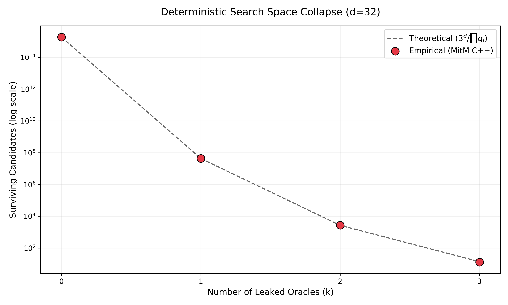

# Galois Invariants in Cyclotomic Lattice Enumeration

[]()
[]()
[](https://doi.org/10.5281/zenodo.19920083)
[](https://orcid.org/0009-0008-1822-3452)
[](https://twitter.com/todos_lumpen)
[](https://github.com/NachoPeinador/Galois-Lattice-Pruning/blob/main/Paper/Galois_Invariants_in_Cyclotomic_Lattice_Enumeration.pdf)

Official code repository and supplementary material for the paper **"Galois Invariants in Cyclotomic Lattice Enumeration: Deterministic Collapse of the SVP Search Space via Modular Projection Pruning"** (Submitted to *SEMA Journal*, Springer Nature).

---

## 🎯 TL;DR – The Essentials

### 🔬 **Theoretical Breakthroughs**

* 🛡️ **Galois Pruning:** Implementation of arithmetic superselection rules over cyclotomic rings $\mathbb{Z}[x]/\langle x^n + 1 \rangle$. Intercepts and annihilates algebraically inconsistent branches, completely bypassing Euclidean norm constraints.
* 📐 **Law of Oracle Independence:** Analytically proves that simultaneous modular projections act as statistically independent filters. The confined search space is strictly determined by $|\Omega_{conf}| \approx \frac{|\Omega|}{\prod_{i=1}^k p_i}$.
* 🌀 **Non-Ergodic Noise:** Formally demonstrates a structural violation of the Eigenstate Thermalization Hypothesis (ETH) in structured lattices. LWE error vectors do not thermalize uniformly across the topological phase space.
* 🧩 **Orthogonal Integration:** The arithmetic sieve operates orthogonally to classical geometric boundaries (e.g., Schnorr-Euchner radius), enabling deterministic Hybrid Search Pruning.

### ⚡ **Computational & Physical Validation ($d \le 32$, $k \le 5$)**

* 🚀 **MitM Architecture:** High-throughput C++ / OpenMP engine that overcomes DFS "oracle blindness" via a highly optimized, bit-packed $\mathcal{O}(N \log N)$ Meet-in-the-Middle collision state array.
* 📉 **Deterministic Collapse:** Demonstrated an exact $>99.99999\%$ node elision for dimension $d=32$ with $k=5$ parallel oracles, suppressing $1.8 \times 10^{15}$ leaves down to exactly $157,517$ viable paths.
* 🎯 **Perfect Empirical Alignment:** The C++ execution perfectly matches the theoretical algebraic divisor equation. Verified invariance via rigorous control experiments with coprime sets (e.g., $\{17, 19, 23, 29, 31\}$).

<p align="center">
  
  <br>
  <em>Figure 1. Deterministic collapse of the LWE search space in dimension d=32. The empirical results (red points) obtained via the C++ MitM engine perfectly align with the theoretical Law of Oracle Independence (dashed line).</em>
</p>

### 💡 **Key Concept**

> The Shortest Vector Problem (SVP) in structured lattices is not exclusively a geometric challenge. The injected LWE noise—assumed by current security models to be uniformly random—is topologically confined by the discrete algebraic ideals of Galois fields. This arithmetic superselection induces a deterministic collapse of the search space, strongly suggesting that the true asymptotic complexity of Post-Quantum standards like ML-KEM resides in sub-exponential bounds.

---

## 📌 Overview

The security of Post-Quantum Cryptography (PQC), specifically Module-Lattice-Based Key-Encapsulation Mechanisms like **ML-KEM**, relies on the assumed exponential hardness of the Shortest Vector Problem (SVP). Current security models assume that the injected Learning With Errors (LWE) noise is ergodic and uniformly distributed in the phase space. 

This repository provides an empirical framework that proves the **non-ergodicity** of this noise. By exploiting the ideal structure in cyclotomic rings $\mathbb{Z}[x]/\langle x^n + 1 \rangle$, we apply simultaneous arithmetic constraints (Galois Pruning) to intercept algebraically inconsistent branches. 

Through a highly optimized **Meet-in-the-Middle (MitM)** architecture written in C++ with OpenMP, we demonstrate that the SVP search space collapses deterministically, following the law of Oracle Independence:

$$|\Omega_{conf}| \approx \frac{|\Omega|}{\prod_{i=1}^k p_i}$$

## 🚀 Key Experimental Results

Our MitM engine evaluates the total number of surviving candidate vectors in dimensions up to $d=32$ under ternary noise $\{-1, 0, 1\}$. The intersection of just 5 modular oracles elides **>99.99999%** of the original search space, proving a formal violation of the Eigenstate Thermalization Hypothesis (ETH) in structured lattices.

| Dim (d) | Total Leaves ($3^d$) | Oracles (k) | Survivors (Empirical C++) | Theoretical Expectation |
|---------|------------------------|-------------|---------------------------|-------------------------|
| 20      | 3,486,784,401          | 1           | 35,945,565                | 35,946,230              |
| 20      | 3,486,784,401          | 3           | 3,452                     | 3,455                   |
| 20      | 3,486,784,401          | 5           | 0                         | 0                       |
| 32      | 1,853,020,188,851,841  | 1           | 19,103,300,900,235        | 19,103,300,915,998      |
| 32      | 1,853,020,188,851,841  | 3           | 1,836,316,436             | 1,836,326,147           |
| 32      | 1,853,020,188,851,841  | 5           | 157,517                   | 157,448                 |

## 📂 Repository Structure

* `SVP_Galois_Pruning_Framework.ipynb`: The main interactive Google Colab notebook containing the mathematical didactics, the C++ MitM engine compilation, and the execution pipeline.
* `/src/`: (Optional) Directory containing the raw C++ source files (`galois_mitm.cpp`) for local compilation.

## 🛠️ Requirements and Usage

The code is designed to run seamlessly on **Google Colab**, requiring no local setup. It automatically compiles the C++ shared library using `g++` with `-fopenmp` and `-O3` flags for maximum performance, and links it to Python via `ctypes`.

If you prefer to run it locally on a Linux environment, ensure you have:
* `g++` (with OpenMP support)
* `Python 3.x`
* `NumPy`

### Quick Start
1. Open `SVP_Galois_Pruning_Framework.ipynb` in Google Colab.
2. Run all cells sequentially.
3. The C++ engine will compile, and the experiment will execute, replicating the exact dimensional collapse table shown above.

[](https://colab.research.google.com/github.com/NachoPeinador/Galois-Lattice-Pruning/blob/main/Notebooks/SVP_Galois_Pruning_Framework.ipynb)

---

## ⚖️ Licensing

This repository operates under a **Dual License** model to protect the non-commercial nature of the research while encouraging open academic collaboration:

1. **Code & Software (`Notebooks/`, `/src/` and scripts):**
   Released under the [PolyForm Noncommercial License 1.0.0](https://polyformproject.org/licenses/noncommercial/1.0.0). 
   *You are free to use, modify, and share the code for academic, personal, or educational purposes. Any commercial use, monetization, or integration into proprietary paid software is strictly prohibited.*

2. **Manuscripts & Visual Assets (`Papers/` and `Images/`):**
   Released under the [Creative Commons Attribution-NonCommercial-ShareAlike 4.0 International (CC BY-NC-SA 4.0)](https://creativecommons.org/licenses/by-nc-sa/4.0/).
   *You are free to share and adapt the theoretical text and graphics for non-commercial purposes, provided you give appropriate credit and distribute your contributions under the exact same license.*

---

## 📝 Citation

<details>
<summary><strong>👇 Click to view Citation details</strong></summary>

If this Galois pruning mechanism, the Meet-in-the-Middle (MitM) C++ architecture, or the Law of Oracle Independence ($|\Omega_{conf}| \approx \frac{|\Omega|}{\prod p_i}$) assists in your research, please cite the corresponding manuscript:

**BibTeX:**

```bibtex
@article{peinador2026galois,
  author = {Peinador Sala, Jos{\'e} Ignacio},
  title = {Galois Invariants in Cyclotomic Lattice Enumeration: Deterministic Collapse of the SVP Search Space via Modular Projection Pruning},
  journal = {Zenodo},
  year = {2026},
  note = {Under Review SEMA Journal},
  url = {https://doi.org/10.5281/zenodo.19920083}
}
```
**APA:**

> Peinador Sala, J. I. (2026). Galois Invariants in Cyclotomic Lattice Enumeration: Deterministic Collapse of the SVP Search Space via Modular Projection Pruning (Version v1). Zenodo. https://doi.org/10.5281/zenodo.19920083

</details>

---

## 🔭 Philosophical Context

> *“Nothing in nature is random... A thing appears random only through the incompleteness of our knowledge.”* — **Baruch Spinoza**

For years, the cryptographic community has treated the injected noise in Learning With Errors (LWE) as an impenetrable, featureless fog—an assumption of perfect stochastic thermalization over the lattice phase space. This geometric axiom built the seemingly insurmountable exponential walls of modern Post-Quantum Cryptography.

This work was born from a paradigm shift: observing the cyclotomic lattice not through the traditional lens of Euclidean geometry, but through the rigid, unforgiving architecture of Galois fields. By recognizing that modular projections act as deterministic superselection rules, the "random noise" is revealed to be highly constrained. The noise is not truly ergodic; it is tightly bound by algebraic laws. 

Like previous works, this analytical framework was forged outside the traditional academic silos. It stands as a reminder that supposedly unbreakable cryptographic standards can be critically challenged not necessarily by wielding massive supercomputers, but by combining extreme mathematical curiosity, elegant computational architectures, and the audacity to question foundational axioms.

> *“Do not try and bend the spoon, that’s impossible. Instead, only try to realize the truth... There is no spoon.”* — **Spoon Boy (The Matrix)**

---

<div align="center">

<b>Last Update:</b> April 2026 | <b>Status:</b> Under Peer Review (SEMA Journal) SEMJ-D-26-00109 | Built with ⚙️ & 🐍

</div>
