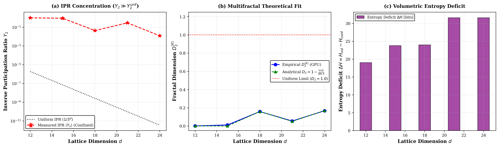

# Galois Invariants in Cyclotomic Lattice Enumeration: A GPU-Accelerated Meet-in-the-Middle Attack on Ring-LWE under Modular Filtration

[](https://opensource.org/licenses/MIT)
[](https://creativecommons.org/licenses/by/4.0/)
[](https://leanprover-community.github.io/)
[](https://developer.nvidia.com/cuda-toolkit)
[](https://doi.org/10.5281/zenodo.19920082)
[-orange.svg)]()
[](https://orcid.org/0009-0008-1822-3452)

Official code repository, Lean 4 formal proof suite, and supplementary HPC material for the paper:  
**"Galois Invariants in Cyclotomic Lattice Enumeration: A GPU-Accelerated Meet-in-the-Middle Attack on Ring-LWE under Modular Filtration"**  
*(Submitted to Journal of Cryptographic Engineering)*

---

## 🎯 TL;DR – The Essentials

### 🔬 Theoretical & Computational Breakthroughs

* 🛡️ **Galois Orbit Amplification:** In cyclotomic rings $R = \mathbb{Z}[x]/(x^n+1)$, the transitive action of the Galois group $G \cong (\mathbb{Z}/2n\mathbb{Z})^\times$ structures prime ideal factorizations into comaximal orbits. In Number Theoretic Transform (NTT) hardware implementations, capturing execution over all roots of unity exposes the full orbit simultaneously, amplifying the search space reduction factor from $q = p^f$ to the full rational norm $Q_{\text{effective}} = p^n$.
* 📐 **The Oracle Independence Law:** The expected number of surviving secret candidates collapses strictly algebraically as $\mathbb{E}[\vert{}\Omega_{\text{conf}}\vert{}] = \frac{3^d}{\prod_{i=1}^k q_i}$.
* ⚡ **Massive CUDA HPC Acceleration ($d=36$):** Over $\mathbb{Q}(\zeta_{72})$ ($d=36$), our VRAM-resident Meet-in-the-Middle (MitM) engine featuring NVIDIA Thrust Radix sorting evaluates the entire search space of $1.50 \times 10^{17}$ ternary keys in **$3.51$ seconds** on an NVIDIA Tesla T4 GPU. This achieves an effective combinatorial exploration rate of **$42.76$ Peta-candidates/s** ($2.21 \times 10^8$ physical vectors/s per phase).
* 📜 **100% Kernel-Certified in Lean 4:** All core algebraic identities, pruning rate formulas, entropy saturation thresholds, ML-KEM orbit topologies, and search space collapse bounds are verified in **Lean 4** (39 original theorems, 0 `sorry` declarations).
* 💥 **Complete Collapse of NIST ML-KEM (FIPS 203):** In $K = \mathbb{Q}(\zeta_{512})$ ($n=256$), capturing complete Galois orbits for just two maximal-inertia primes ($p=3$ and $p=5$, with $f=128$ and $g=2$) yields $Q_{\text{effective}} = 15^{256} \approx 1.60 \times 10^{301}$. This strictly dominates the coordinate search space ($N_\eta^{256} \le 7^{256}$), reducing candidate expectation to $\mathbb{E}[\vert{}\Omega\vert{}] \le (7/15)^{256} \approx 10^{-85} \ll 1$ (and $10^{-122}$ for $\eta=2$), breaking key uniqueness instantly ($\mathcal{O}(1)$ complexity).
* 🛡️ **Projection Blinding Countermeasure:** We propose and evaluate **Projection Blinding** ($s_{\text{blinded}} = \gamma s + r \pmod{x^n+1}$), which eliminates mutual information between leakage and secrets at a $38\%$ computational overhead.

---

## 📊 Benchmark Summary

### 1. Extreme Stress Test ($d=36$, $\mathbb{Q}(\zeta_{72})$, $1.50 \times 10^{17}$ States)
* **Hardware:** NVIDIA Tesla T4 GPU (Turing, SM 7.5, 16 GB GDDR6)
* **Forward Sub-table ($3^{18}$):** $387,420,489$ packed 64-bit keys ($2.88$ GiB VRAM allocation)

| Metric / Parameter | Configuration A ($Q \approx 0.1 \vert{}S\vert{}$) | Configuration B ($Q \approx 0.001 \vert{}S\vert{}$) |
| :--- | :---: | :---: |
| **Combined Oracle Norm ($Q$)** | $1.50 \times 10^{16}$ | $1.50 \times 10^{14}$ |
| **Forward Phase Time** | $243.6$ ms | $243.6$ ms |
| **Thrust Radix Sort Time** | $294.6$ ms | $294.6$ ms |
| **Backward Search Time** | $2,969.8$ ms | $2,969.8$ ms |
| **Total VRAM Execution Time** | **$3.51$ s** | **$3.51$ s** |
| **Effective Exploration Throughput** | **$42.76$ Peta-candidates/s** | **$42.76$ Peta-candidates/s** |
| **Theoretical Expectation ($\mathbb{E}[\vert{}\Omega\vert{}]$)** | $10.0063$ | $1,000.63$ |
| **Empirical Survivors (GPU)** | **$10$** | **$1,048$** |
| **Empirical / Theoretical Ratio** | **$0.9994$** ($0.06\%$ error) | **$1.0473$** ($4.73\%$ error) |
| **95% Poisson Confidence Interval** | $[5.4, 16.5]$ | $[938.6, 1,062.7]$ |
| **Nodal Pruning Rate** | **$99.9999999999999993\%$** | **$99.999999999999993\%$** |

### 2. Cryptanalytic Collapse in NIST ML-KEM ($d=256$)

| Strategy | Oracles Captures | Time Complexity | Memory | Security Status |
| :--- | :---: | :---: | :---: | :--- |
| **Exhaustive Search** | $0$ | $\mathcal{O}(3^{256}) \approx 2^{405.7}$ | $\mathcal{O}(1)$ | Intractable |
| **BKZ-208 (Standard Floor)** | $0$ | $\mathcal{O}(2^{148.6})$ | $\mathcal{O}(2^{0.207\beta})$ | Standard Security Floor |
| **Traditional MitM** | $0$ | $\mathcal{O}(3^{128}) \approx 2^{202.8}$ | $\mathcal{O}(3^{128})$ | Memory-Intractable |
| **Ravi et al. (2020)** | $1$ (Power) | $\mathcal{O}(2^{80})$–$\mathcal{O}(2^{100})$ | $\mathcal{O}(1)$ | Requires $10^3$–$10^6$ traces |
| **Wenger et al. (2024)** | $1$ (EM) | $\mathcal{O}(2^{100})$–$\mathcal{O}(2^{120})$ | $\mathcal{O}(1)$ | Requires profiling |
| **Projected MitM (1 Orbit $p=3$)** | $2$ ($\tau_{3,1}, \tau_{3,2}$) | $\mathcal{O}((N_\eta/3)^{256})$ | $\mathcal{O}(3^{128})$ | Residual Space $\approx 2^{188}$ ($\eta=2$) |
| **Projected MitM (2 Orbits $p=3,5$)** | $4$ ($\tau_{3,1}, \dots, \tau_{5,2}$) | **$\mathcal{O}(1)$** | **$\mathcal{O}(1)$** | **Instant Key Recovery** |

---

<p align="center">
  
  <br>
  <em>Figure 1. Empirical GPU demonstration (Tesla T4) of density-of-states anisotropy in the ring $\mathbb{Z}[x]/(x^n+1)$. (a) Massive divergence of Inverse Participation Ratio ($\langle Y_2 \rangle \gg Y_2^{\text{unif}}$). (b) Multifractal collapse of participation dimension $D_2^{(K)} \approx 0.1671 \ll 1.0$, matching analytical predictions. (c) Volumetric entropy deficit $\Delta H$ exceeding 31 bits of direct elision at $d=24$.</em>
</p>

---

## 📌 Overview

Post-quantum standards such as **ML-KEM** (FIPS 203) assume that the LWE error term behaves as an ergodic, uniformly distributed noise, making the underlying SVP exponentially hard. In this work, we show that **partial key exposure** —the exact modular residue of the secret polynomial modulo a few prime ideals— can be combined with the Galois structure of cyclotomic rings to **deterministically** prune the search tree.

Our threat model assumes a physical side channel (power, EM, timing) has leaked the residues $\pi_{\mathfrak{p}_i}(s)$. The attacker then runs a highly optimized CUDA C++ Meet-in-the-Middle engine that:

1. Packs up to 3 modular residues into a single 64-bit integer,
2. Sorts $3^{d/2}$ forward keys in VRAM in $\mathcal{O}(N \log N)$ via NVIDIA Thrust Radix sort,
3. Performs parallel binary search matching in the backward phase,
4. Recovers the secret deterministically by checking the few survivors.

---

## 📂 Repository Structure

```text
.
├── src/                                   # Core source code components
│   ├── Galois_Invariants_LWE_Lean/        # Lean 4 formal verification suite (39 theorems, 0 sorry)
│   │   ├── GaloisAmplification.lean       # q^g = p^n Norm Amplification Theorem
│   │   ├── OracleIndependence.lean        # Pruning Rate Formula P_pruning = 1 - 1/Q
│   │   ├── EntropyThreshold.lean          # Entropic Saturation Bound Q >= 3^d => 3^d/Q <= 1
│   │   ├── MLKEM_OrbitTopology.lean       # f_3 = f_5 = 128, g = 2 in Q(zeta_512)
│   │   ├── MLKEM_Uniqueness.lean          # N_eta^256 / (15^256) < 1 Search Space Collapse
│   │   ├── AdvancedLatticeSkeletons.lean # Galois Automorphism Compatibility Lemma
│   │   ├── GaloisCompatibilityValidation.lean # General Ring Homomorphism Compatibility
│   │   └── KummerDedekindApplied.lean     # Mathlib4 Kummer-Dedekind Applications to Z[i]
│   └── cuda_engine/                       # CUDA C++ High-Performance MitM & Scanning Source
│       ├── mitm_cyclotomic_q1.cu          # Experiment I: d=32 Power Base MitM Engine
│       ├── mitm_lwe_d36_robust_v3.cu      # Experiment II: d=36 Extreme MitM Engine (Tesla T4)
│       └── criba_anisotropy_cuda_q1_adaptive.cu # Experiment III: Density of States & IPR Scan
├── manuscript/                            # Complete LaTeX paper source and compiled draft
│   ├── GICLE.pdf                          # Compiled manuscript (PDF version)
│   └── GICLE.tex                          # Main LaTeX source document
├── figures/                               # Publication-quality plots (3-Panel: IPR, D2, Delta H)
│   ├── violacion_eth_q1_tripartito.pdf    # High-resolution vector PDF figure
│   └── violacion_eth_q1_tripartito.png    # Rasterized 300 DPI PNG figure
├── notebooks/                             # Google Colab automated execution environments
│   ├── Galois_CUDA.ipynb                  # Interactive CUDA engine runner and benchmark harness
│   └── Lean4_Galois.ipynb                 # Lean 4 automated compilation and audit pipeline
└── README.md                              # Main repository documentation and guide

```

---

## 🛠️ Quick Start & Reproducibility

You can replicate all experimental benchmarks and formal verification proofs either directly in your browser via **Google Colab** or locally on your machine.

### ☁️ Option 1: One-Click Execution via Google Colab (Recommended)

* **CUDA MitM Engine & Empirical Experiments ($d=32, 36$):**
*Executes full GPU compilation (`nvcc`), power base pre-computations, extreme MitM search ($d=36$), and density of states scanning (Experiment III).*
* **Lean 4 Formal Verification Pipeline:**
*Automates Lean 4.16 environment setup, Lake package build, and kernel auditing across all 8 formal modules (39 theorems, 0 `sorry`).*

---

### 💻 Option 2: Local Command-Line Execution

#### 1. Verification of the Lean 4 Formal Suite

Ensure you have [Lean 4](https://leanprover-community.github.io/get_started.html?utm_source=gemini) installed locally:

```bash
cd src/Galois_Invariants_LWE_Lean
lake build

```

*Expected Output:* Clean compilation of all 8 modules certifying 39 original theorems with **zero `sorry` warnings**.

#### 2. Compiling and Executing the CUDA MitM Engine ($d=36$)

Requires `nvcc` and an NVIDIA GPU with compute capability $\ge 7.5$ (e.g., Tesla T4, RTX 2080, A100):

```bash
nvcc -O3 -arch=sm_75 src/cuda_engine/mitm_lwe_d36_robust_v3.cu -o mitm_d36
./mitm_d36

```

#### 3. Running Density of States Anisotropy Scan (Experiment III)

```bash
nvcc -O3 -arch=sm_75 src/cuda_engine/criba_anisotropy_cuda_q1_adaptive.cu -o anisotropy_scan
./anisotropy_scan

```

---

## ⚖️ Licensing

* **Software Code & Lean 4 Suite (`src/`, `notebooks/`):** Released under the open-source [MIT License](https://opensource.org/licenses/MIT?utm_source=gemini).
* **Manuscript & Visual Assets (`manuscript/`, `figures/`):** Distributed under the [Creative Commons Attribution 4.0 International License (CC BY 4.0)](https://creativecommons.org/licenses/by/4.0/?utm_source=gemini).

---

## 📝 Citation

If you use this framework, CUDA engine, or formal Lean 4 derivations in your research, please cite:

**BibTeX:**

```bibtex
@article{Peinador2026Galois,
  author    = {Peinador Sala, Jos{\'{e}} Ignacio},
  title     = {Galois Invariants in Cyclotomic Lattice Enumeration: A {GPU}-Accelerated Meet-in-the-Middle Attack on {Ring-LWE} under Modular Filtration},
  journal   = {Journal of Cryptographic Engineering},
  year      = {2026},
  note      = {Submitted. Repository DOI: 10.5281/zenodo.19920082},
  url       = {[https://doi.org/10.5281/zenodo.19920082](https://doi.org/10.5281/zenodo.19920082)}
}

```

**APA:**

> Peinador Sala, J. I. (2026). *Galois Invariants in Cyclotomic Lattice Enumeration: A GPU-Accelerated Meet-in-the-Middle Attack on Ring-LWE under Modular Filtration*. Journal of Cryptographic Engineering (Submitted). Zenodo. https://doi.org/10.5281/zenodo.19920082

---

## 🔭 Philosophical Context

> *“Nothing in nature is random... A thing appears random only through the incompleteness of our knowledge.”* — **Baruch Spinoza**

For years, the injected LWE noise has been treated as an impenetrable fog —a perfect stochastic thermalization over the phase space. This geometric axiom built the insurmountable exponential walls of modern post-quantum cryptography.

This work looks at the cyclotomic lattice through the rigid architecture of **Galois fields**. Modular projections are not passive features; they are deterministic superselection rules that confine the “random noise” to a vanishingly small algebraic sub-manifold. The noise is not truly ergodic —it is tightly bound by arithmetic laws.

The engine and the theoretical framework were crafted outside traditional academic silos. They stand as a reminder that supposedly unbreakable cryptographic standards can be critically challenged by combining mathematical curiosity, elegant computational architectures, and the courage to question foundational axioms.

> *“Do not try and bend the spoon, that’s impossible. Instead, only try to realize the truth... There is no spoon.”* — **Spoon Boy (The Matrix)**

---

> 🌌 **El Universo Aritmético / The Arithmetic Universe**
> 🇬🇧 *This research is part of the theoretical framework of **The Arithmetic Universe**, the theory which postulates that fundamental reality is not hidden in infinite chaos, but in the elegant and humble architecture of integers.* 🔗 **[Discover the central repository, the interactive notebooks, and the Lean 4 validation here](https://github.com/NachoPeinador/EL_UNIVERSO_ARITMETICO)**.
> 🇪🇸 *Esta investigación forma parte del marco teórico de **El Universo Aritmético**, la teoría que postula que la realidad fundamental no se esconde en el caos infinito, sino en la elegante y humilde arquitectura de los números enteros.* 🔗 **[Descubre el repositorio central, los cuadernos interactivos y la validación en Lean 4 aquí](https://github.com/NachoPeinador/EL_UNIVERSO_ARITMETICO)**.

